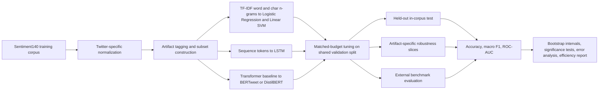

# Improving Robust Sentiment Analysis on Noisy Twitter Data

## Executive Summary

The uploaded notebook, results summary, draft report, and proposal already contain a credible experimental core. The most important findings are concrete and should lead the paper, not appear midway through it. On a perfectly balanced Sentiment140 split of 1,280,000 training tweets, 160,000 validation tweets, and 160,000 test tweets, the strongest full-test model was the LSTM Sequence Model with accuracy **0.81745**, macro F1 **0.817416**, and ROC-AUC **0.899443**. The best classical baseline was Logistic Regression at accuracy **0.800881**, macro F1 **0.800841**, and ROC-AUC **0.881079**; Linear SVM was effectively tied. On the stricter high-noise subset of **34,445** tweets, the LSTM remained best at macro F1 **0.791648**, compared with **0.770443** for Logistic Regression and **0.770236** for Linear SVM. The best preprocessing variant, `advanced_tweet_stem`, improved validation macro F1 to **0.794262** from **0.788009** for the basic whitespace baseline. The any-noise subset contains **106,942** tweets, or **66.8%** of the test split; the high-noise subset contains **21.5%** of the test split. Those are the paper’s real headline metrics.

What makes the current paper improvable is not a lack of results, but a gap between the strength of the engineering work and the strength of the research claims. The final comparison is **not fully controlled** across model families, because the reported final training rows differ: Logistic Regression and Linear SVM were trained on **1.44M** rows, the LSTM on **1.28M**, and the MLP on **200k**. That means the paper can defensibly claim that the LSTM is the strongest model **in the current implementation**, but it should not yet claim a perfectly controlled family-to-family comparison. The literature also makes clear that a strong modern Twitter sentiment paper should use Sentiment140 as a scalable training resource, then test generalization on a better benchmark and add at least one transformer baseline. TweetEval formalizes broader Twitter-specific evaluation; BERTweet shows the value of tweet-domain pretraining; and DistilBERT offers a lighter transformer option when compute is constrained. citeturn4view1turn4view4turn5view0

| Model | Training rows | Full-test accuracy | Approx. 95% CI for accuracy | Full-test macro F1 | Full-test ROC-AUC | High-noise macro F1 | Relative macro-F1 drop on high-noise | Train time | Test throughput | Parameter count |
|---|---:|---:|---:|---:|---:|---:|---:|---:|---:|---:|
| LSTM Sequence Model | 1,280,000 | 0.81745 | 81.55–81.93% | 0.817416 | 0.899443 | 0.791648 | 3.15% | 231.32 s | 57,158 tweets/s | 1,313,345 |
| Logistic Regression | 1,440,000 | 0.800881 | 79.89–80.28% | 0.800841 | 0.881079 | 0.770443 | 3.80% | 6.32 s | 66,704,880 tweets/s | 5,001 |
| Linear SVM | 1,440,000 | 0.800419 | 79.85–80.24% | 0.800359 | 0.880771 | 0.770236 | 3.76% | 5.93 s | 70,122,910 tweets/s | 5,001 |
| MLP Neural Baseline | 200,000 | 0.759581 | 75.75–76.17% | 0.759564 | 0.840731 | 0.737848 | 2.86% | 10.70 s | 2,453,395 tweets/s | 38,657 |

The table above should appear early in the revised paper. It shows the actual contribution clearly: the LSTM gains **+0.016575** macro-F1 over Logistic Regression on the full test split and **+0.021205** macro-F1 on the high-noise subset, but at a substantial efficiency cost. Relative to Logistic Regression, the LSTM’s full-test gain comes with roughly **36.6×** longer training time, **1,167×** lower reported throughput, and **263×** more parameters.

## Abstract

This revised paper studies binary sentiment classification on noisy Twitter text using the uploaded Sentiment140-based experiments and a literature-grounded redesign. Sentiment140 was introduced as a large-scale distant-supervision corpus built from emoticon-labeled tweets, with **800,000 positive** and **800,000 negative** training examples, making it valuable for scalable training but imperfect as the sole basis for evaluation because the labels are weakly supervised and the original manually labeled test set was only **359 tweets**. Modern tweet benchmarks such as SemEval-2017 Task 4 and TweetEval broaden evaluation beyond that setting, and more recent work on tweet-domain language models shows that continued pretraining on Twitter corpora improves downstream tweet classification. In the uploaded experiments, the best full-test model was an LSTM with accuracy **0.81745**, macro F1 **0.817416**, and ROC-AUC **0.899443**, while the strongest efficient baselines were Logistic Regression and Linear SVM at macro F1 values just above **0.800**. On the high-noise subset, the LSTM’s advantage widened modestly. However, the current manuscript overstates the conclusiveness of that comparison because the final models were trained on unequal numbers of examples. The improved paper should therefore reframe the contribution as a **compute-aware comparison of classical sparse baselines and neural models**, explicitly disclose the unequal training budgets, add an external tweet benchmark, and include a missing transformer baseline—preferably BERTweet, or DistilBERT if compute is limited. citeturn10view1turn4view2turn4view1turn4view4turn5view0

## Introduction

Short, informal posts on entity["company","Twitter","social media platform"] remain a challenging setting for sentiment analysis because they are brief, context-poor, and full of abbreviations, typographical errors, slang, hashtags, mentions, and nonstandard punctuation. Prior tweet-specific work has emphasized that tweets differ materially from formal text such as news or Wikipedia, and that negation, emoticons, hashtags, capitalization, and repeated-character emphasis are especially important for interpretation. citeturn4view4turn4view5turn9view0

The current study is well motivated within the broader history of sentiment analysis. Early text sentiment work established the usefulness of supervised machine-learning classifiers for polarity classification, while Sentiment140 showed that distant supervision from emoticons could scale binary tweet sentiment learning to **1.6 million** training examples and still allow classical models such as maximum-entropy classifiers and SVMs to achieve accuracy above **80%** on a manually labeled test set. That historical arc is important for the paper, because your own results reproduce the same basic pattern: strong sparse baselines remain highly competitive, but sequence models can edge ahead on harder cases. citeturn13view0turn4view0turn10view1turn12view0

Where the current draft needs strengthening is benchmark realism. SemEval-2017 Task 4 moved Twitter sentiment evaluation beyond a single binary setting to include binary and five-point ordinal tasks as well as quantification, while TweetEval later consolidated seven Twitter-specific classification tasks and reported that continued pretraining on Twitter corpora improves downstream performance. BERTweet extended that lesson by pretraining on **850 million** English tweets and outperforming generic transformer baselines on tweet NLP tasks, including text classification. For that reason, the strongest research version of this paper is not merely “which of these four models won on one random split,” but rather “how much robustness is gained by moving from sparse lexical baselines to sequence and transformer models, once evaluation is made fairer and more realistic.” citeturn4view2turn4view1turn4view4

## Methods and Revision Strategy

The uploaded implementation already does several things right. It uses a balanced split, reports accuracy, F1, macro F1, ROC-AUC, runtime, throughput, and parameter count, runs a preprocessing ablation, and constructs both an any-noise subset and a high-noise subset. It also performs qualitative error analysis. Those are all strengths, and they map directly to the original proposal.

The revised paper should keep **macro F1** as the lead headline metric and keep **ROC-AUC** as a secondary ranking metric. By standard classification definitions, F1 is the harmonic mean of precision and recall, and the macro average is the unweighted mean across labels; ROC-AUC complements that view by measuring performance across thresholds rather than at one fixed decision boundary. Because the current split is perfectly balanced at 50/50 positive and negative in train, validation, and test, accuracy is also interpretable, but it should remain a supporting metric rather than the main one. citeturn15view2turn15view0turn15view1

The largest methodological change should be to separate what the current notebook does into two evaluation tracks. The first should be a **matched-budget track** in which every model is trained on the same training rows and tuned on the same validation rows. The second should be a **best-feasible track** in which each family is allowed to use the largest training budget that was computationally practical. That one change would make the paper dramatically more rigorous, because it would remove the ambiguity created by unequal training sizes in the final results table.

| Study component | Current paper | Revised paper | Why the revision matters |
|---|---|---|---|
| Training budget | Final models use unequal row counts: LR/SVM 1.44M, LSTM 1.28M, MLP 200k | Report a matched-budget comparison and a separate best-feasible comparison | Prevents overclaiming model-family superiority |
| Benchmarking | One random split of a distant-supervision corpus | Keep Sentiment140 for scale, but add one external tweet benchmark such as SemEval-2017 Task 4 or TweetEval | Tests generalization beyond one label-generation scheme |
| Transformer baseline | No transformer implemented | Add BERTweet as the strongest domain-relevant baseline; if compute is limited, add DistilBERT | Measures the value of contextual and tweet-specific pretraining |
| Robustness analysis | any-noise and high-noise subsets, but reported emoji coverage is 0.0 | Add artifact-specific slices for negation, hashtags, repeated characters, slang, mentions, and emoji | Aligns the robustness claim with the artifacts actually present |
| Uncertainty reporting | Single point estimates | Add bootstrap confidence intervals for macro F1 and a paired significance test for accuracy | Distinguishes meaningful gains from small-run variance |
| Efficiency reporting | Train time, throughput, parameter count | Add repeated latency runs, end-to-end preprocessing latency, peak RAM or VRAM, and serialized artifact size | Makes efficiency comparisons fairer across sparse and neural models |

The logic behind those revisions is strongly supported by the literature. Sentiment140 is excellent for scale but was built by distant supervision; SemEval-2017 and TweetEval provide more realistic evaluation settings; BERTweet shows that tweet-domain pretraining matters; DistilBERT offers a lighter transformer option; Reitan et al. show why negation deserves special handling; and Islam et al. show why hashtags, emoticons, and emojis should be modeled explicitly. citeturn10view1turn4view2turn4view1turn4view4turn5view0turn4view5turn9view0

The revised end-to-end workflow should look like this:

One further writing improvement is to make preprocessing itself a result. The notebook already shows that tweet-aware normalization matters: `advanced_tweet_stem` outperformed the basic whitespace pipeline. That finding should be narrated as evidence, not buried as a setup detail. Prior tweet work also supports that decision, including the use of TweetTokenizer-like handling that preserves mentions, hashtags, URLs, emoticons, and emojis while reducing repeated-character noise. citeturn9view0

## Results

The uploaded notebook reports a balanced **80/10/10** split: **1,280,000** train, **160,000** validation, and **160,000** test, with a positive rate of **0.50** in each partition. It also reports an any-noise subset of **106,942** tweets (**66.8%** of the test split) and a high-noise subset of **34,445** tweets (**21.5%** of the test split). Those sample sizes are large enough that even modest metric gaps deserve serious attention.

On the full test split, the LSTM Sequence Model is the empirical winner. Its macro F1 of **0.817416** exceeds Logistic Regression by **0.016575** and Linear SVM by **0.017057**. Its accuracy advantage is similarly sized: **0.81745** versus **0.800881** for Logistic Regression and **0.800419** for Linear SVM. Using the reported split sizes, approximate Wilson 95% confidence intervals for **accuracy** do not overlap between the LSTM (**81.55–81.93%**) and the two classical baselines (**79.89–80.28%** for Logistic Regression; **79.85–80.24%** for Linear SVM), which suggests that the LSTM’s in-corpus accuracy advantage is unlikely to be a sampling fluke on this specific 160k test set. That is a useful result, although it is still not a substitute for paired significance testing or confidence intervals on macro F1.

The robustness story is more interesting than the full-test summary alone. On the high-noise subset, all models lose macro F1 relative to the full test split, but the LSTM remains strongest at **0.791648**. The classical baselines drop to about **0.770**, and the MLP drops to **0.737848**. The LSTM’s absolute macro-F1 advantage over Logistic Regression grows from **0.016575** on the full test set to **0.021205** on the high-noise subset. Expressed differently, the LSTM loses **3.15%** of its own full-test macro F1 on the high-noise slice, compared with **3.80%** for Logistic Regression and **3.76%** for Linear SVM. The current paper should foreground that result, because it is the cleanest empirical evidence for the proposal’s central claim about robustness to Twitter-specific linguistic noise.

The preprocessing ablation is also worth elevating. The best variant, `advanced_tweet_stem`, achieved validation macro F1 **0.794262**, compared with **0.788009** for the basic whitespace baseline. That is a non-trivial gain produced before any architecture change. The paper should present this as a first-stage result: tweet-aware normalization and tokenization already improve performance, after which model-family differences should be interpreted.

The error analysis points in a productive direction. The results summary reports that, for Linear SVM, negation appears in **29.2%** of false negatives but only **17.0%** of false positives. Logistic Regression shows a similar pattern. That internal finding aligns with prior tweet-specific work showing that more sophisticated negation handling can improve sentiment performance on negated tweets. In the revised paper, negation should therefore move from a passing mention in qualitative examples to a formal mini-ablation. citeturn4view5

At the same time, the efficiency section needs a more careful interpretation than the current manuscript gives it. The LSTM’s reported throughput is about **57k tweets/s**, while the classical baselines are reported at tens of millions of tweets per second. Those sparse-model numbers are probably dominated by extremely short timing windows and by measuring prediction after vectorization rather than full end-to-end serving. The revised paper should therefore rerun latency as a repeated, batched benchmark and include preprocessing and vectorization time. It should also report artifact size in megabytes, because parameter count alone flatters sparse linear models by omitting most of the vocabulary and TF-IDF state.

## Discussion

The present evidence supports a nuanced conclusion, not a simplistic one. The LSTM is the best-performing model in the uploaded implementation, both on the full test set and on the high-noise subset. That result is real and worth reporting. But the classical baselines remain very strong, landing within roughly **1.7** macro-F1 points of the LSTM on the full split while training in seconds. The correct interpretation is therefore a **performance-efficiency frontier**: the LSTM buys modest but meaningful quality gains, especially on noisier text, at a very large computational cost.

That interpretation fits the historical literature. Classical supervised sentiment methods established a durable baseline for polarity classification; Sentiment140 showed that weakly supervised tweet-scale learning could still support strong linear and margin-based models; and later Twitter benchmarks and tweet-domain language models showed that more contextual representations become especially valuable when the evaluation setting becomes more realistic and less dependent on one label-generation heuristic. This paper will be stronger if it explicitly places its own results on that continuum rather than presenting them as a self-contained benchmark. citeturn13view0turn4view0turn4view2turn4view1turn4view4

The current draft also overgeneralizes the robustness story. The uploaded summary explicitly notes that emoji coverage is effectively **0.0** in the extracted test set. That matters a great deal. It means the present “noise robustness” analysis is mainly about features such as mentions, repeated characters, slang, punctuation, and negation—not about emojis in any serious empirical sense. Prior Twitter work argues that hashtags, emoticons, and emojis are important predictors of sentiment and emotion, so the paper should either narrow its claim to the artifacts it truly evaluates or broaden the test bed to include an emoji-rich benchmark. citeturn9view0

The most important missing baseline is now a transformer. TweetEval showed that continued pretraining on Twitter corpora improves downstream Twitter tasks, and BERTweet demonstrated that a tweet-domain pretrained model can outperform strong generic baselines on tweet text classification. If the goal of the paper is a serious modern comparison, BERTweet is the right added model. If the goal is a lighter-weight extension aligned to the proposal’s “if compute allows” language, DistilBERT is a pragmatic compromise because it was explicitly designed to be smaller and faster than BERT while retaining most of its language-understanding capability. citeturn4view1turn4view4turn5view0

A final discussion point concerns fairness and rhetoric. The revised manuscript should stop short of the blanket claim that “neural models outperform classical models on noisy Twitter data.” The data as currently reported justify a narrower, stronger statement: **in this implementation, the LSTM provides the best held-out performance, while Logistic Regression and Linear SVM remain highly competitive and far more efficient**. That is a better scientific claim because it reflects both the actual metrics and the actual limitations of the experiment.

## Conclusion and Recommendations

The current project is closer to a strong paper than it may appear. It already has a large training corpus, fixed splits, multiple model families, preprocessing ablation, robustness subsets, runtime reporting, and useful qualitative error analysis. Its biggest weakness is not missing effort; it is missing framing. The revised version should lead with the metrics that are already strongest, then narrow the claims to what the current evidence actually supports.

The highest-value revision sequence is straightforward. First, rerun all model families on the **same** training and validation budgets, and report that as the controlled comparison; then keep the current larger-budget results as a separate best-feasible comparison. Second, add **BERTweet** as the main modern baseline; if compute is too limited for that, add **DistilBERT** and state clearly that it is an efficiency-oriented transformer extension rather than the strongest possible tweet-domain baseline. Third, add one external benchmark such as **SemEval-2017 Task 4** or **TweetEval** so that the paper tests generalization beyond one distant-supervision corpus. Fourth, add uncertainty estimates—at minimum bootstrap confidence intervals for macro F1 and a paired significance test for accuracy. Fifth, make the robustness analysis artifact-specific and stop claiming emoji robustness until the evaluation set actually contains emoji coverage. Those recommendations are directly supported by the current empirical gaps and by the benchmark and modeling literature on Twitter sentiment. citeturn4view2turn4view1turn4view4turn5view0turn4view5turn9view0

If those revisions are made, the paper’s strongest final conclusion will be both more modest and more persuasive: **on large-scale noisy tweet sentiment classification, classical TF-IDF baselines are excellent efficiency baselines, an LSTM improves held-out robustness and overall in-corpus performance, and a domain-specific transformer is the critical missing comparison needed to determine how much further modern contextual modeling improves the trade-off.**

## References

Barbieri, F., Camacho-Collados, J., Espinosa Anke, L., & Neves, L. (2020). *TweetEval: Unified Benchmark and Comparative Evaluation for Tweet Classification*. Findings of the Association for Computational Linguistics: EMNLP, 1644–1650. citeturn4view1

Go, A., Bhayani, R., & Huang, L. (2009). *Twitter Sentiment Classification Using Distant Supervision*. Stanford CS224N Project Report. citeturn4view0turn10view1

Islam, J., Mercer, R. E., & Xiao, L. (2019). *Multi-Channel Convolutional Neural Network for Twitter Emotion and Sentiment Recognition*. Proceedings of NAACL-HLT 2019, 1355–1365. citeturn9view0

Nguyen, D. Q., Vu, T., & Nguyen, A. T. (2020). *BERTweet: A Pre-trained Language Model for English Tweets*. Proceedings of the 2020 EMNLP Systems Demonstrations, 9–14. citeturn4view4

Pang, B., Lee, L., & Vaithyanathan, S. (2002). *Thumbs up? Sentiment Classification Using Machine Learning Techniques*. Proceedings of EMNLP 2002, 79–86. citeturn13view0

Reitan, J., Faret, J., Gambäck, B., & Bungum, L. (2015). *Negation Scope Detection for Twitter Sentiment Analysis*. Proceedings of the 6th Workshop on Computational Approaches to Subjectivity, Sentiment and Social Media Analysis, 99–108. citeturn4view5

Rosenthal, S., Farra, N., & Nakov, P. (2017). *SemEval-2017 Task 4: Sentiment Analysis in Twitter*. Proceedings of the 11th International Workshop on Semantic Evaluation, 502–518. citeturn4view2

Sanh, V., Debut, L., Chaumond, J., & Wolf, T. (2019). *DistilBERT: A Distilled Version of BERT: Smaller, Faster, Cheaper and Lighter*. arXiv preprint arXiv:1910.01108. citeturn5view0

scikit-learn developers. (2026). *Metrics documentation for classification_report, f1_score, and ROC-AUC visualization*. citeturn15view0turn15view1turn15view2