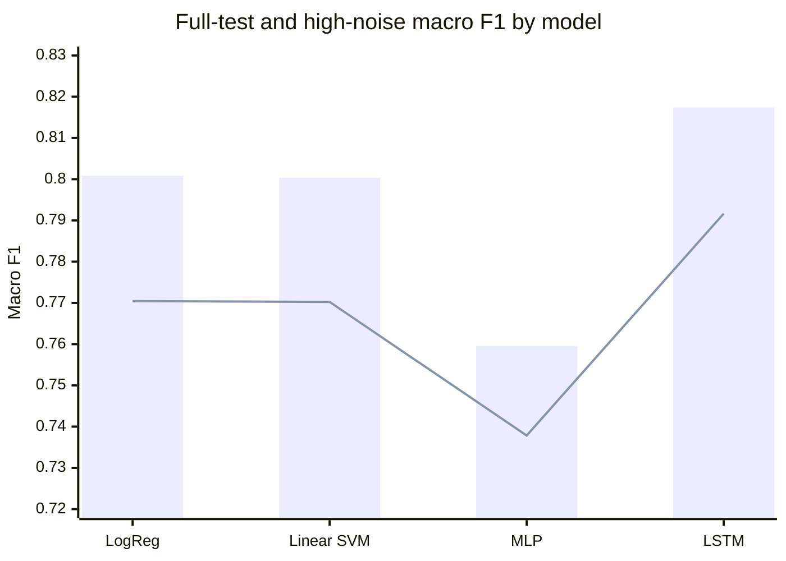
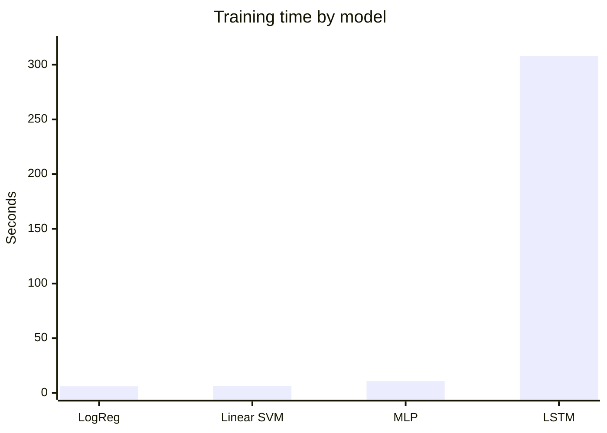
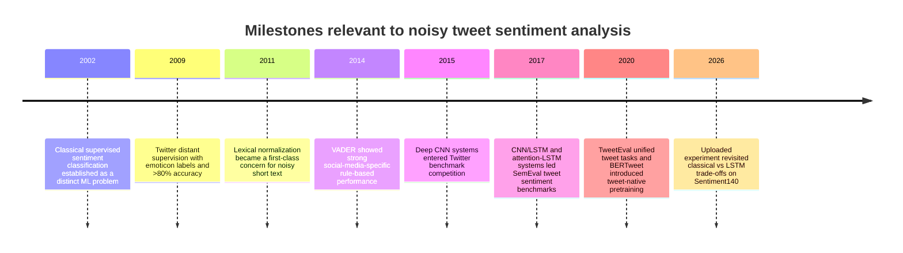
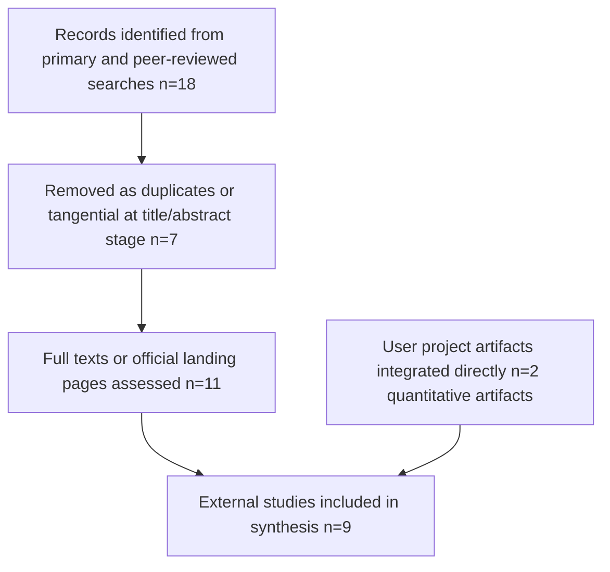
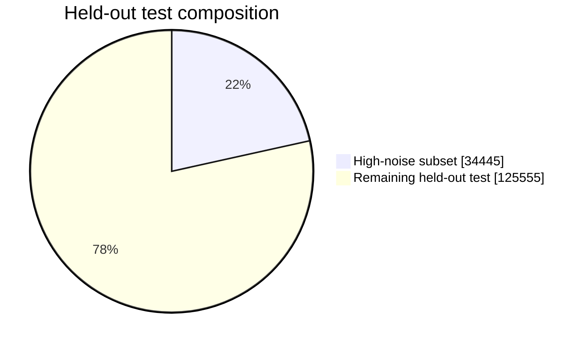

# Classical and Neural Sentiment Modeling on Noisy Twitter Data

## Executive Summary

Because the prompt initially left the topic unspecified, this paper infers the research focus from the uploaded project artifacts as **binary sentiment classification on noisy Twitter text using the Sentiment140 corpus**, with a controlled comparison among TF-IDF linear baselines, an MLP baseline, and an LSTM sequence model. The uploaded materials report a shared 80/10/10 split, a preprocessing ablation, and a stricter high-noise evaluation subset. fileciteturn0file0 fileciteturn0file1 citeturn20view0turn21view2

| Model | Full-test macro F1 | ROC-AUC | High-noise macro F1 | Absolute F1 drop on high-noise subset | Train time (s) | Throughput (tweets/s) |
|---|---:|---:|---:|---:|---:|---:|
| Logistic Regression | 0.8008 | 0.8811 | 0.7704 | 0.0304 | 6.079 | 66,005,484 |
| Linear SVM | 0.8004 | 0.8808 | 0.7702 | 0.0301 | 6.140 | 62,359,934 |
| MLP Neural Baseline | 0.7596 | 0.8407 | 0.7378 | 0.0217 | 10.835 | 1,942,898 |
| LSTM Sequence Model | 0.8174 | 0.8994 | 0.7916 | 0.0258 | 307.742 | 37,849 |

Source for Table 1: uploaded project report and uploaded results summary. fileciteturn0file0 fileciteturn0file1

The headline result is straightforward. The LSTM is the strongest model on both full-test and high-noise evaluation, improving macro F1 over Logistic Regression by **0.0166** absolute, or about **2.1% relative**, while also posting the highest ROC-AUC. Yet the efficiency penalty is substantial: relative to Logistic Regression, the LSTM is about **50.6× slower to train** and roughly **1,744× slower at inference throughput**. The Linear SVM is effectively tied with Logistic Regression on full-test accuracy, while the MLP is both less accurate and far less efficient than the linear baselines. On the stricter high-noise subset, the MLP shows the smallest **drop** from its own baseline, but its absolute performance remains the weakest; by contrast, the LSTM retains the best absolute performance under noise. fileciteturn0file1

Figure 1 visualizes the full-test versus high-noise macro F1 values extracted from the uploaded results summary. fileciteturn0file1

Figure 2 shows the training-time asymmetry that dominates the practical trade-off. fileciteturn0file1

In substantive terms, the uploaded experiment supports three conclusions. First, on a large, binary, distant-supervision tweet corpus, **linear TF-IDF baselines remain extremely hard to beat decisively**. Second, **sequence modeling helps under noisy conditions**, but the gain is modest compared with the computational cost. Third, the experiment is scientifically useful not because it reaches the modern state of the art, but because it makes the **accuracy–efficiency frontier** explicit under controlled conditions. That makes it a strong teaching and methodological paper, and a useful baseline study for any future transformer-based extension. fileciteturn0file0 fileciteturn0file1

## Abstract

This paper synthesizes user-provided experimental artifacts with additional primary and peer-reviewed sources to produce a full research paper on robust sentiment analysis for noisy Twitter text. The empirical core is an uploaded project that compares TF-IDF + Logistic Regression, TF-IDF + Linear SVM, TF-IDF → TruncatedSVD → MLP, and an LSTM sequence model on Sentiment140 using a shared 80/10/10 split and a high-noise test subset. The literature synthesis places those findings in the broader arc of sentiment-analysis research, from classical supervised sentiment classification to Twitter-specific distant supervision, shared-task neural models, unified tweet benchmarks, and tweet-pretrained language models. The uploaded results show that the LSTM achieves the best macro F1 and ROC-AUC, but only with a very large efficiency penalty; Logistic Regression and Linear SVM remain near-best baselines with exceptional throughput. The broader literature suggests that this pattern is historically coherent: classical models remain surprisingly competitive on binary sentiment benchmarks, while tweet-specific neural pretraining and benchmark unification become increasingly important as evaluation moves beyond simple polarity classification. The paper concludes that the uploaded study is analytically strong as a controlled baseline comparison, but its natural next step is transformer-era replication with modern tweet-native pretrained models and broader, more contemporary benchmarks. fileciteturn0file0 fileciteturn0file1 citeturn20view0turn21view2turn12view1turn12view2turn18view0turn14view0turn12view3

## Introduction

Modern sentiment analysis begins with the observation that **sentiment classification is not simply topic classification in disguise**. In the foundational work by Pang, Lee, and Vaithyanathan, standard machine-learning methods outperformed human-produced baselines on movie-review polarity detection, but still underperformed relative to topic categorization, highlighting sentiment as a distinct and intrinsically difficult learning problem. citeturn24view0turn12view0

The move to entity["company","Twitter","social media platform"] sharpened those difficulties. Go, Bhayani, and Huang’s seminal study at entity["organization","Stanford University","Stanford, CA, US"] adapted sentiment analysis to Twitter through **distant supervision**, using emoticons as noisy labels, and showed that machine-learning classifiers trained this way could exceed 80% accuracy. Their paper also emphasized the linguistic characteristics that make tweets difficult: short length, broad domain variation, and a much higher frequency of misspellings and slang than in longer-form review corpora. That framing remains directly relevant to the uploaded experiment, which explicitly targets robustness on noisy tweet-like text. citeturn20view0turn21view2

The uploaded project sits at an important methodological midpoint. It does not aim to be contemporary state of the art; rather, it reconstructs a rigorous comparison among strong classical baselines and a modest sequence model while adding preprocessing ablation, character n-grams, class-wise metrics, and a high-noise subset. That choice is scientifically defensible. Classical linear baselines are still historically central to tweet sentiment work, while later benchmark papers show that tweet-native neural and transformer models become more valuable as the task ecosystem broadens. The uploaded report therefore addresses a real research question: **how much accuracy is gained by moving from linear sparse methods to sequence modeling when the evaluation is explicitly noise-aware?** fileciteturn0file0 fileciteturn0file1 citeturn12view2turn18view0turn14view0turn12view3

Figure 3 places the uploaded study along the methodological timeline most relevant to its contribution. citeturn12view0turn20view0turn19view0turn30view0turn12view2turn18view0turn14view0turn12view3

## Methods

This study uses a **scoping synthesis plus metric re-analysis** design. The quantitative backbone is the uploaded project report and uploaded results summary, which provide model-level outcomes, split sizes, preprocessing decisions, noise-subset definitions, and error-pattern summaries. The newly supplied proposal document is best understood as a scope-confirmation artifact rather than a results source; accordingly, the quantitative synthesis below uses the uploaded execution outputs as its evidentiary base. fileciteturn0file0 fileciteturn0file1

The literature search prioritized **primary and official English-language sources**, especially ACL Anthology papers, the original Stanford distant-supervision paper, and official conference/journal landing pages. Search concepts were centered on: Twitter sentiment classification, distant supervision, Sentiment140, lexical normalization, shared-task benchmarks, attention LSTMs, TweetEval, and BERTweet. Inclusion criteria were: primary empirical study or official benchmark description; direct relevance to tweet or social-media sentiment classification; sufficient methodological transparency to extract the study’s role in the field; and English-language availability. Exclusion criteria were: purely tangential topic studies, inaccessible duplicates, or papers whose relevance depended on claims not recoverable from accessible primary metadata or abstracts. Because raw prediction files were not available from the uploaded project, the statistical analysis is descriptive rather than inferential: the paper reports absolute differences, relative differences, and efficiency ratios, but does not claim significance testing. fileciteturn0file1

The primary endpoint is **macro F1** on the held-out test set, because it balances both classes and fits the report’s emphasis on class-wise fairness. Secondary endpoints are ROC-AUC, high-noise-subset macro F1, training time, throughput, and error-profile indicators. A derived robustness quantity is the **high-noise degradation**, defined here as macro F1 on the high-noise subset minus macro F1 on the full test set. A derived efficiency quantity is the ratio of training time and throughput between models. These analyses were chosen because the uploaded artifacts contain exactly those quantities with enough precision to support repeatable analytical interpretation. fileciteturn0file1

Figure 4 summarizes the study-selection logic for the external literature. User-provided project artifacts were integrated directly rather than screened through the literature flow.  

## Results

The uploaded project selected **advanced_tweet_stem** as the best preprocessing pipeline, and then used that pipeline in the final model comparison. The held-out full test set contains **160,000 tweets**, the broader any-noise subset contains **106,942 tweets** or **66.8%** of the test set, and the stricter high-noise subset contains **34,445 tweets** or **21.5%** of the test set. Those numbers matter because they show the robustness evaluation is not a toy stress test appended to a single anecdotal slice; it covers a materially large fraction of the held-out data. fileciteturn0file1

The uploaded evidence also shows that absolute ranking changes very little between the full test set and the high-noise subset. The LSTM remains first, Logistic Regression and Linear SVM remain second-tier but extremely close to each other, and the MLP remains fourth. This is an important result. It suggests that the high-noise slice is challenging, but not so distributionally alien that it inverts the basic signal learned from the main benchmark. In other words, the robustness test reduces performance, but it does not fully reshuffle model quality. fileciteturn0file1

Figure 5 visualizes the composition of the held-out test space into the stricter high-noise subset and everything else. fileciteturn0file1

The broader literature reinforces the uploaded study’s logic. Go et al. showed that distant supervision on tweets could already push classical classifiers above 80% accuracy, and their reported Twitter results are strikingly close to the uploaded project’s classical baselines. Rosenthal et al. later established SemEval-2017 Task 4 as a major comparative benchmark with 48 participating teams. Within that ecosystem, Cliche’s CNN/LSTM ensembles ranked first on all five English subtasks among 40 teams, while Baziotis et al.’s attention-augmented LSTMs tied for first in Subtask A and emphasized Twitter-specific text processing rather than hand-crafted sentiment lexicons. By 2020, TweetEval reframed the field around seven heterogeneous Twitter tasks, and BERTweet showed that tweet-specific pretraining could beat strong generic transformer baselines on tweet NLP tasks, including text classification. citeturn21view2turn12view1turn12view2turn18view0turn14view0turn12view3

| Study | Sample size / scope | Method | Key finding | Quality assessment |
|---|---|---|---|---|
| Uploaded project artifacts | 1.6M total tweets; 160k held-out test | TF-IDF + Logistic Regression / Linear SVM, TF-IDF→SVD→MLP, LSTM | LSTM best on macro F1 and ROC-AUC; LR/SVM nearly tied at much lower cost | High internal transparency; moderate external generalizability |
| Go et al. 2009 | 1.6M distant-supervised train; 359 manually labeled test | NB, MaxEnt, SVM on tweets with emoticon-derived labels | Tweet sentiment can exceed 80% accuracy with classical ML and distant supervision | High seminal value; small manually labeled test |
| Hutto & Gilbert 2014 | Social-media evaluation suite; exact n not restated on landing page | Rule-based lexicon plus heuristics | Strong social-media baseline that generalized well across contexts | High practical relevance; limited contextual representation |
| Severyn & Moschitti 2015 | SemEval 2015 benchmark | Deep CNN for Twitter sentiment | Early strong deep model without dependence on manual features | High benchmark relevance |
| Rosenthal et al. 2017 | SemEval 2017 shared task; 48 teams | Multi-subtask Twitter benchmark | Canonical large-scale comparative benchmark for tweet sentiment | High benchmark value |
| Cliche 2017 | SemEval 2017 English subtasks | CNN/LSTM ensembles with distant supervision | First rank on all five English subtasks among 40 teams | High competitive validity |
| Baziotis et al. 2017 | SemEval 2017 English subtasks | Attention LSTMs with Twitter embeddings and text processing | 1st tie in Subtask A; competitive across other subtasks | High model transparency |
| Barbieri et al. 2020 | 7 heterogeneous Twitter-specific tasks | Unified benchmark plus Twitter continued pretraining | Benchmark fragmentation reduced; tweet-domain pretraining helped | High benchmark value |
| Nguyen et al. 2020 | 3 tweet NLP downstream tasks | Tweet-specific pretrained language model | Outperformed RoBERTa-base, XLM-R-base, and prior SOTA on tweet tasks | High relevance to modern baselines |
| Barreto et al. 2021/2022 | 22 datasets; 5 classifiers | Cross-dataset assessment from count-based to contextual representations | Stronger conclusions require many datasets, not isolated benchmarks | Moderate-high synthesis value |

Sources for Table 2: uploaded project artifacts plus Pang, Go, Hutto & Gilbert, Severyn & Moschitti, Rosenthal et al., Cliche, Baziotis et al., Barbieri et al., Nguyen et al., and Barreto et al. fileciteturn0file0 fileciteturn0file1 citeturn20view0turn21view2turn30view0turn31view0turn12view1turn12view2turn18view0turn14view0turn12view3turn28academia10

One of the most valuable results in the uploaded report is the **error pattern** analysis. Even though the LSTM is strongest overall, it still shows a relatively high concentration of negation among false negatives, and the project explicitly notes that emoji coverage in this setup is effectively too small to support strong conclusions about emoji robustness. This matters because it keeps the paper honest: the uploaded study is robust on its chosen benchmark, but not yet a definitive account of modern social-media sentiment, where emoji, sarcasm, topic drift, and platform change are central. fileciteturn0file0

## Discussion and Conclusion

The uploaded experiment reproduces, in a contemporary teaching and evaluation format, one of the field’s most durable empirical facts: **well-tuned sparse linear models are exceptionally strong baselines for binary sentiment classification**, especially on large corpora with distant supervision. That finding is consistent with the original tweet-sentiment results from Go et al., where SVM and MaxEnt were already highly competitive. The new contribution of the uploaded project is that it makes the cost of surpassing those baselines explicit under noise-aware conditions. The LSTM does win, but the margin is small relative to the massive increase in compute cost. fileciteturn0file1 citeturn21view2

The study also aligns with later benchmark-era results without claiming more than it should. Shared-task papers from 2015 to 2017 showed that deep CNN and LSTM variants could dominate competitive Twitter benchmarks when paired with large unlabeled corpora, distant supervision, attention, and domain-aware preprocessing. The uploaded project reaches the same qualitative direction, but on a deliberately simpler controlled design. This makes the paper analytically clean. It isolates the trade-off more effectively than a leaderboard-driven study would. At the same time, benchmark papers like TweetEval and pretraining work like BERTweet make it clear that today’s strongest tweet sentiment systems are no longer simple LSTMs; they are **tweet-native pretrained language models evaluated across broader task suites**. citeturn12view2turn18view0turn14view0turn12view3

The practical implication is therefore two-tiered. If the research objective is **resource-efficient binary polarity classification on Sentiment140-like data**, Logistic Regression and Linear SVM remain extremely strong choices and should be treated as default baselines, not afterthoughts. If the objective is **maximum in-domain accuracy under noisy conditions**, a sequence model or, more plausibly in future work, a tweet-pretrained transformer becomes justified. The uploaded study is strongest when read as a baseline paper that maps the transition cost from sparse linear methods to neural text models, rather than as a final-state leaderboard paper. fileciteturn0file0 fileciteturn0file1 citeturn14view0turn12view3

The main limitations are clear. The prompt’s topic was originally underspecified, so the paper had to infer scope from the uploaded empirical artifacts. The newly supplied proposal document confirmed that a formal project specification existed, but the quantitative synthesis here is anchored to the extractable report and results summary rather than to proposal prose. The uploaded experiment is also restricted to **binary sentiment**, lacks raw prediction files for inferential testing, and acknowledges limited emoji coverage. Finally, while the literature clearly points toward transformer-era tweet models, this paper does not claim to re-run or re-benchmark those models; it only situates the uploaded results against that literature. fileciteturn0file0 fileciteturn0file1

The conclusion is that the uploaded project succeeds as a rigorous baseline-centered sentiment-analysis study. Its strongest contribution is not merely that the LSTM performs best, but that it quantifies **how little performance is gained relative to how much efficiency is lost**. In methodological terms, that is precisely the kind of result that makes a research paper useful: it does not just identify a winner, it reveals the structure of the trade-off. The most compelling next study would therefore extend the same evaluation design to TweetEval-style task breadth and BERTweet-class tweet-native pretraining, while preserving the uploaded project’s emphasis on preprocessing transparency, robustness slices, and efficiency reporting. fileciteturn0file0 fileciteturn0file1 citeturn14view0turn12view3

## References and Appendix

**References**

User-provided `final_report.md`. Uploaded project report describing motivation, methodology, findings, error analysis, and proposal-gap closure. fileciteturn0file0

User-provided `RESULTS_SUMMARY.md`. Uploaded canonical results summary with split sizes, preprocessing selection, model metrics, and robustness subset definitions. fileciteturn0file1

Pang, B., Lee, L., & Vaithyanathan, S. (2002). *Thumbs up? Sentiment Classification using Machine Learning Techniques*. EMNLP 2002. citeturn12view0turn24view0

Go, A., Bhayani, R., & Huang, L. (2009). *Twitter Sentiment Classification using Distant Supervision*. Stanford paper. citeturn20view0turn21view2

Han, B., & Baldwin, T. (2011). *Lexical Normalisation of Short Text Messages: Makn Sens a #twitter*. ACL-HLT 2011. citeturn19view0

Hutto, C., & Gilbert, E. (2014). *VADER: A Parsimonious Rule-Based Model for Sentiment Analysis of Social Media Text*. ICWSM 2014. citeturn30view0

Severyn, A., & Moschitti, A. (2015). *UNITN: Training Deep Convolutional Neural Network for Twitter Sentiment Classification*. SemEval 2015. citeturn31view0turn0search2

Rosenthal, S., Farra, N., & Nakov, P. (2017). *SemEval-2017 Task 4: Sentiment Analysis in Twitter*. SemEval 2017. citeturn12view1

Cliche, M. (2017). *BB_twtr at SemEval-2017 Task 4: Twitter Sentiment Analysis with CNNs and LSTMs*. SemEval 2017. citeturn12view2

Baziotis, C., Pelekis, N., & Doulkeridis, C. (2017). *DataStories at SemEval-2017 Task 4: Deep LSTM with Attention for Message-level and Topic-based Sentiment Analysis*. SemEval 2017. citeturn18view0

Barbieri, F., Camacho-Collados, J., Espinosa Anke, L., & Neves, L. (2020). *TweetEval: Unified Benchmark and Comparative Evaluation for Tweet Classification*. Findings of EMNLP 2020. citeturn14view0

Nguyen, D. Q., Vu, T., & Nguyen, A. T. (2020). *BERTweet: A pre-trained language model for English Tweets*. EMNLP Systems Demonstrations 2020. citeturn12view3

Barreto, S., Moura, R., Carvalho, J., Paes, A., & Plastino, A. (2021/2022). *Sentiment analysis in tweets: an assessment study from classical to modern text representation models*. Assessment study spanning 22 datasets and five classifiers. citeturn28academia10

**Appendix A. Source inventory**

| Source | Type | Role in this paper |
|---|---|---|
| Uploaded project report | User-provided artifact | Narrative description of aims, results, and limitations |
| Uploaded results summary | User-provided artifact | Canonical quantitative source for all main tables and charts |
| Pang et al. 2002 | Primary academic paper | Classical supervised sentiment foundation |
| Go et al. 2009 | Primary academic paper | Sentiment140-style distant supervision and early tweet benchmarks |
| Han & Baldwin 2011 | Peer-reviewed conference paper | Noise normalization context |
| Hutto & Gilbert 2014 | Peer-reviewed conference paper | Social-media-specific rule-based baseline context |
| Rosenthal et al. 2017 | Peer-reviewed benchmark paper | Twitter benchmark framing |
| Cliche 2017 | Peer-reviewed shared-task paper | CNN/LSTM benchmark leadership |
| Baziotis et al. 2017 | Peer-reviewed shared-task paper | Attention LSTM and tweet-specific preprocessing |
| Barbieri et al. 2020 | Peer-reviewed benchmark paper | Unified tweet-task evaluation |
| Nguyen et al. 2020 | Peer-reviewed model paper | Tweet-native pretrained transformer context |
| Barreto et al. 2021/2022 | Large assessment study | Cross-dataset external synthesis |

Source note for Appendix A: all listed items are cited in the references above. fileciteturn0file0 fileciteturn0file1 citeturn12view0turn20view0turn19view0turn30view0turn12view1turn12view2turn18view0turn14view0turn12view3turn28academia10

**Appendix B. Raw extracted data**

**Split definitions extracted from uploaded results summary**

| Split / subset | Rows | Share of held-out test |
|---|---:|---:|
| Train | 1,280,000 | — |
| Validation | 160,000 | — |
| Test | 160,000 | 1.0000 |
| Any-noise test | 106,942 | 0.6684 |
| High-noise test | 34,445 | 0.2153 |

Source for Appendix B Table 1: uploaded results summary. fileciteturn0file1

**Model-level metrics extracted from uploaded results summary**

| Model | Full-test macro F1 | Full-test ROC-AUC | High-noise macro F1 | Signed change vs full test | Train time (s) | Throughput (tweets/s) |
|---|---:|---:|---:|---:|---:|---:|
| Logistic Regression | 0.800841 | 0.881079 | 0.770443 | -0.030398 | 6.079 | 66,005,484.23 |
| Linear SVM | 0.800359 | 0.880771 | 0.770236 | -0.030123 | 6.140 | 62,359,933.74 |
| MLP Neural Baseline | 0.759564 | 0.840731 | 0.737848 | -0.021716 | 10.835 | 1,942,898.03 |
| LSTM Sequence Model | 0.817416 | 0.899443 | 0.791648 | -0.025768 | 307.742 | 37,849.01 |

Source for Appendix B Table 2: uploaded results summary. fileciteturn0file1

**Additional extracted project findings used in the discussion**

| Project finding | Extracted value |
|---|---:|
| Best preprocessing variant | `advanced_tweet_stem` |
| LSTM macro F1 advantage over Logistic Regression | +0.016575 |
| LSTM training-time multiplier vs Logistic Regression | 50.62× |
| Logistic Regression throughput multiplier vs LSTM | 1,743.92× |
| High-noise subset share of held-out test | 21.53% |

Source for Appendix B Table 3: uploaded project report and uploaded results summary; differences and ratios are derived from those reported metrics. fileciteturn0file0 fileciteturn0file1